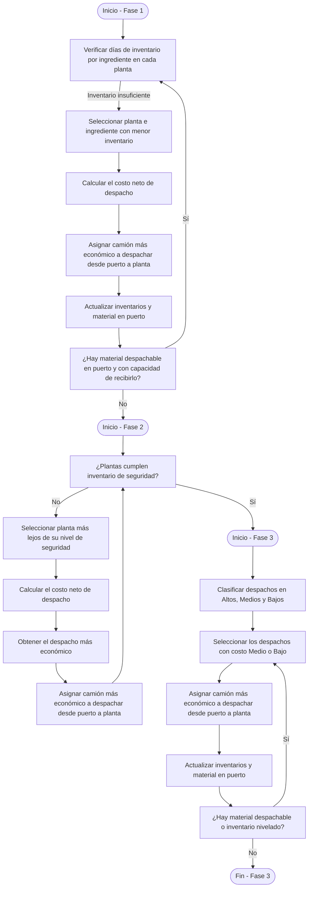

# Documentación del Modelo

## Introducción

Este documento describe el funcionamiento de una aplicación desarrollada en C# que implementa un modelo de optimización logística para determinar la cantidad de camiones que deben despacharse desde los puertos marítimos colombianos hacia las plantas de producción. El objetivo es minimizar el costo total de la operación logística, garantizando que las plantas cuenten con los materiales necesarios para operar y manteniendo un nivel mínimo de inventario de seguridad.

La solución consta de un procedimiento dividido en cuatro fases que combinan enfoques heurísticos y un modelo de programación lineal entera mixta. Cada fase contribuye al objetivo general del modelo y está diseñada para abordar distintos aspectos del problema de despacho.

# Contexto del Problema

## Escenario

### Ingredientes/Materias Primas importadas

Constituyen los elementos que serán transportados entre los puertos y las plantas.

### Puertos

Los puertos marítimos reciben materias primas importadas, identificadas por el número de importación, el puerto de llegada y el operador de la operación logística. Los puertos aportan parámetros relevantes en terminos de costo:

- **Costos Portuarios por Despacho Directo:** Se generan con cada camión que se carga con material que es extraído directamente de la motonave.

- **Costos Portuarios por Bodegaje:** Se generan al final del día cuando la motonave termina de entregar el ingrediente con el material que queda almacenamdo en el puerto.

- **Costos de almacenamiento por vencimiento:** Cuando el material es almacenado en puerto, se establecen unas fechas de corte donde se cobra un valor por kilogramo guardado en el puerto.

### Transporte

Las materias primas pueden ser:

1.	Despachadas directamente en camiones hacia las plantas.

2.	Almacenadas temporalmente en el puerto antes de su despacho.

El transporte tiene un costo por camión despachado entre los puertos y las plantas, pudiendo variar con el operador y el ingrediente transportado.

### Plantas:

- Las plantas tienen un consumo diario estimado de cada materia prima.

- Las materias primas son almacenadas en unidades específicas de almacenamiento, cuya capacidad varía según el tipo de ingrediente.

- Las plantas pueden tener definido un stock de seguridad en días de inventario. Este valor depende del consumo para ser convertido en kilogramos guardados como inventario de seguridad.

## Objetivo del Modelo

Minimizar el costo total de logística durante el periodo de planeación, que incluye:

- Costo portuario: Descarga de materiales en camión o bodega.

- Costo de flete: Transporte de materias primas desde el puerto hasta las plantas.

- Costo de almacenamiento: Almacenamiento de materias primas en el puerto, calculado en función del peso almacenado y el costo por kilogramo.

El modelo no tiene en cuenta costos de bodegaje causados en periodos anteriores al inicio del horizonte de planeación.

## Restricciones

1.	Mientras existan ingredientes en los puertos, las plantas deben garantizar su operación diaria sin interrupciones.

2.	Las plantas deben mantener un nivel mínimo de inventario definido como inventario de seguridad, siempre que exista material disponible en puerto.

3.	Cada unidad de almacenamiento puede asignarse a un solo ingrediente.

# Metodología de Solución

## Estructura del Procedimiento

El procedimiento se divide en cuatro fases secuenciales. Las tres primeras son heurísticas y la cuarta utiliza un modelo matemático de optimización para ajustar los resultados. El siguiente diagrama presenta de manera general este procedimiento:

### Cálculo del Costo Neto

El costo neto $Cn$ es el indicador base que usará el procedimiento de solución para decidir entre dos despachos posibles cuál resulta más conveniente en términos de su aporte al costo total del plan. Para todo posible despacho de material en una importacion hacia una planta durante el horizonte de planeación, se puede obtener el $Cn$ así:

$$Cn= Fl + Dr_{t} - Ci - Ab_{t} - Av_{t}$$

donde:
- $Fl$ es flete por camión entre el puerto, el operador y la planta para cada ingrediente;

- $Dr_{t}$ es el costo portuario por despacho directo que aplica solo durante el descarge de la motonave;

- $Ci$ que es el costo intercómpany;

- $Ab_{t}$ siendo el dinero que se pagaria por el ingreso de material a bodega en puerto y que se cobra al final del dia $t$ cuando se termina el descargue de la motonave; y

- $Av_{t}$ el dinero que se pagaría por el material al momento del corte de almacenamiento.

Para todo lo anterior, $t$ esta dentro del horizonte de planeación.

Note que los costos de almacenamiento $Ab_{t}$ y $Av_{t}$ se descuentan solo si el despacho analizado se efectua antes del momento del bodegaje (en despachos directos) y/o del vencimiento del almacenamiento respectivamente, haciendo más conveniente un despacho que otro. 

### Calculo del grupo de despacho

Al examinar el conjunto de despachos, se puede encontrar que se pueden agrupar en 3 grupos según su Costo Neto. Esta agrupación será útil para juzgar un despacho planeado como de costo alto, medio o bajo. Los despachos con costo alto solo serán justificables para evitar una ruptura de inventario en planta, incluso para evitar que una planta tenga menos inventario que el nivel de seguridad definido. De modo que si los inventarios de seguridad estan garantizados, se podrá llevar inventario del puerto siempre que el despacho no esté marcado con un costo neto alto.

La asignación de los grupos de costo neto se hacen convenientemente usando un agoritmo K-Means.

### Fase 1: Garantizar el Consumo Diario

Objetivo: Evitar que las plantas se queden sin materias primas durante el horizonte de planificación.

1.	Seleccionar la planta e ingrediente con la menor cantidad de días de inventario.

2.	Determinar el despacho más económico utilizando el costo neto por camión $Cn$, definido como: 

3.	Repetir hasta que:

- No haya material disponible para despacho en los puertos.
- Todas las plantas tengan garantizado su consumo diario.

### Fase 2: Asegurar el Inventario de Seguridad

**Objetivo**: Cumplir con los niveles mínimos de inventario en cada planta.

1.	Identificar la planta más alejada de su nivel de inventario de seguridad.

2.	Determinar el despacho más económico según el costo neto.

3.	Repetir hasta que:

    - Todas las plantas alcancen el nivel de inventario de seguridad.
    
    - No haya material disponible para despacho.

### Fase 3: Nivelación de Inventarios

**Objetivo**: Despachar el inventario en puerto manteniendo nivelados los inventarios en días para los ingredientes en planta.

1.	Obtener la lista de despachos posibles cuyo grupo de despacho no sea el grupop clasificado como "Alto".

2.	Priorizar el despacho de material en los grupos Medio y Bajo, evitando los costos clasificados como Altos.

3.	En cada iteración, asignar camiones para nivelar los días de inventario de cada ingrediente entre las plantas.

4.	Repetir hasta que la lista de despachos posibles sea nula.

### Fase 4: Optimización Global

**Objetivo**: Reasignar los despachos planeados para reducir aún más el costo total.
1.	Implementar un modelo de programación lineal entera mixta que:
o	Mantiene el volumen diario mínimo despachado planeado en las fases anteriores.
o	Busca la reasignación de camiones para minimizar el costo total.
2.	Resolver el modelo con herramientas como OR-Tools o SCIP.

# Salidas del Modelo

La aplicación genera las siguientes salidas:
1.	Reporte de despacho: Cantidad de camiones a despachar desde cada puerto hacia cada planta, detallado por tipo de ingrediente y día.
2.	Reporte de Puertos: Relaciona las cantidades en inventario al final de cada día por cada importación en puerto, costos de boegaje, y vencimiento causados
3.	Reporte de Plantas: Estado final de los inventarios de cada planta por tipo de ingrediente, inclutendo capacidades de almacenamiento, de recepción e inventairos de seguridad.

Los archivos anteriores constituyen la información insumo para un reporte POWER BI que permite visualizar los planes de despacho y el estado de los inventarios.