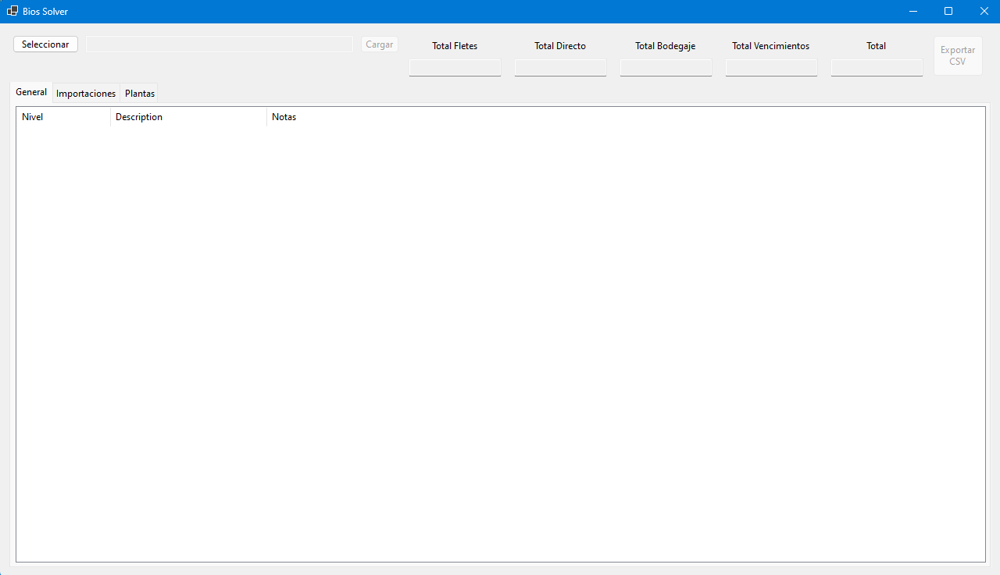
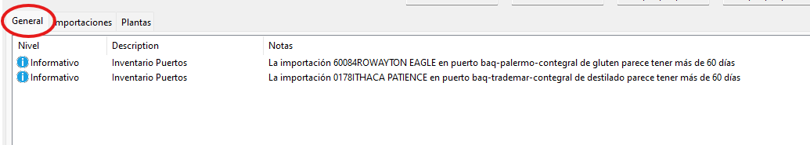
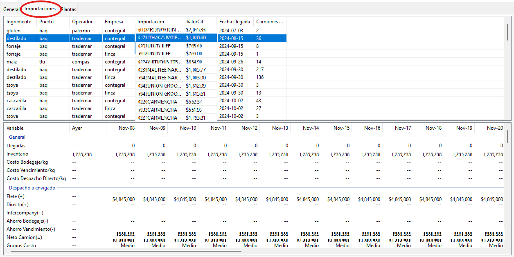

# Tutorial: Cómo Usar la Aplicación de Optimización Logística

Esta aplicación ha sido diseñada específicamente para resolver problemas logísticos complejos relacionados con la importación, distribución y almacenamiento de materias primas. Es importante destacar que solo las personas con un conocimiento profundo del negocio podrán utilizarla adecuadamente, ya que los resultados dependen de la calidad de los datos proporcionados y la interpretación de los mismos.

A continuación, se detallan los pasos y funciones principales para usar la aplicación de manera eficiente.

## Interfaz de Usuario

Al iniciar la aplicación, se muestra una ventana principal con una interfaz sencilla que contiene tres botones principales y varias pestañas para navegar entre funciones.

### Botones Principales

1. Seleccionar 

Este botón permite al usuario cargar un archivo Excel con la información de entrada. El archivo debe seguir la plantilla proporcionada previamente, la cual debe estar completa y validada antes de ser cargada.

**Recomendación:** Antes de cargar el archivo, asegúrate de que toda la información sea correcta y completa, ya que esto influirá directamente en los resultados generados por el modelo.

2. Cargar 

Una vez que el archivo ha sido seleccionado, presiona este botón para ejecutar el solucionador.

Antes de hacer clic en "Cargar", revisa las advertencias y mensajes de la pestaña General. Estas advertencias pueden indicar inconsistencias en los datos o posibles problemas con la solución.  

3. Exportar CSV 

Este botón se habilitará automáticamente cuando el solucionador haya terminado de procesar la información.

Permite seleccionar una carpeta donde se exportarán los resultados del modelo en formato CSV. Los archivos exportados están listos para ser analizados con herramientas adicionales, como Power BI.

## Navegación entre Pestañas
La aplicación cuenta con tres pestañas principales que permiten explorar los datos y resultados del modelo:

1. General
Muestra advertencias y mensajes importantes generados antes y durante la ejecución del modelo.
Es la primera pestaña que debe revisarse antes de hacer clic en "Cargar".
2. Importaciones
Presenta una lista de las importaciones realizadas en los puertos.
Al seleccionar una importación específica, se muestra un listview con el detalle de la operación, incluyendo:
Llegadas de material.
Inventarios al final del período.
Costos relacionados.
Información de despacho hacia las plantas.

3. Plantas

Contiene una lista de las plantas incluidas en el modelo.

Al seleccionar una planta, se muestran detalles específicos para cada ingrediente gestionado, como:

- Inventarios disponibles.
- Consumos previstos.
- Cantidades en tránsito.
- Información adicional relevante para la toma de decisiones.

**Recomendación Adicional:** 
- Uso de Power BI:
La interfaz de esta aplicación no está diseñada para analizar el impacto detallado de cada decisión. Por ello, se recomienda utilizar el archivo de Power BI desarrollado para este propósito. Este archivo permite examinar de manera visual e interactiva los datos exportados, facilitando el análisis de los resultados y su impacto en las operaciones del negocio.

## Consejos para Usar la Aplicación
Conocimiento del Negocio:
Esta aplicación no es un sistema genérico y requiere de usuarios con experiencia en la logística de importaciones y distribución. Es fundamental que los usuarios entiendan cómo los datos de entrada influyen en las decisiones generadas por el modelo.

## Validación de Datos:
Asegúrate de que la plantilla de Excel esté completa y sea precisa. Cualquier error en los datos de entrada puede llevar a resultados inexactos o poco útiles.

## Análisis Posterior:
Utiliza el archivo de Power BI para realizar un análisis más profundo de los resultados, ya que la interfaz de la aplicación solo presenta un resumen de los mismos.

## Conclusión
Esta herramienta es una solución potente y específica para el negocio logístico. Sin embargo, su efectividad depende del conocimiento y experiencia de los usuarios que la operen. Utilízala con responsabilidad y asegúrate de comprender los datos de entrada y resultados antes de tomar decisiones estratégicas.

Si tienes alguna pregunta o necesitas soporte, contacta al equipo de desarrollo.